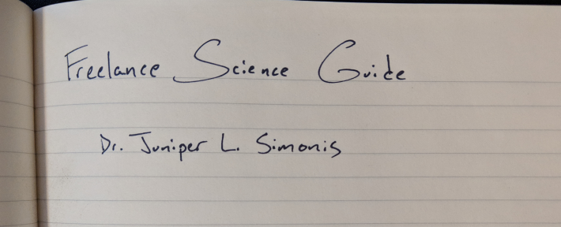

--- 
title: "Freelance Science Guide"
author: "Dr. Juniper L. Simonis"
date: "2020-02-16"
site: bookdown::bookdown_site
documentclass: book
bibliography: [references.bib]
biblio-style: apalike
link-citations: yes
github-repo: dapperstats/freelancescience
cover-image: "images/cover.png"
url: 'https\://freelancescience.guide'
description: "A guide to freelancing science."
---

# Preface {-}

Welcome to the site of the **being-drafted** *Freelance Science Guide* by Dr. Juniper L. Simonis (*they/them*) of [DAPPER stats](http://dapperstats.com).

This book is licensed under the [CC BY-NC-SA 4.0 license](http://creativecommons.org/licenses/by-nc-sa/4.0/).

Source code is housed on [GitHub](https://github.com/DAPPERstats/FreelanceScience) and continuous integration is maintained on [Travis](https://travis-ci.org/dapperstats/FreelanceScience).

 

